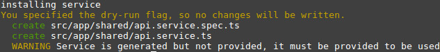

# Angular 4 - first contact

## Introduction

I've never used TDD project-wide before. This time I want to try it hard especially when writing services. I want to learn mocking and refactoring based on the tests (DI etc.). In this article I'll (try to) cover creating really simple API service and test for it, so it can be extended with more complex functionallity later. As for now, it will be simple wrapper around Angular's Http service.

Let's go!

# API service

## Why do I need API service?

I am creating the API service for the purpose of easily isolate storing my API's URL and connecting to it by low level API like Angular's $http or simply Ajax. If done right, the low-level connecting API can be changed later based on requirements. In addition we can easily add e. g. logging feature for all of our requests.

The API service will be used by other modules like authentication, users etc. so we'll need to create a mock for it as well.

## File structure

[Angular Style Guide](https://angular.io/guide/styleguide "Angular - Style Guide") tells us to organize our folders basing on feature. That way we can easily organize our feature's files in single NgModule. So, let's do it the right way.

### Do we need separate API module (and folder)?

The API service will be widely used by all features and modules, so it will fit perfect to [`Shared` feature (folder)](https://angular.io/guide/styleguide#shared-feature-module "Angular - Style guide - Shared feature module"). I'll build a SharedModule as well to include shared services and component.

Ok then, let's move on to creating the service!

## Angular CLI

I am using Angular CLI for generating template files of my project. First I want to see what files would it exactly create, so I use --dry-run switch. In my terminal I type `ng generate service shared/api --dry-run` or shorter way `ng g s shared/api --dry-run`.



Everything looks all right. We have 2 generated files in our `app/shared` directory: API Service itself and the `spec` file containing tests. Now, when we know what Angular CLI will do for us, let's run it for real: `ng g s shared/api`.

We have got our folders structure and necessary files, so let's move on to writing test.

# Test/spec

We can see that in the `app/shared/api.service.spec.ts` Angular CLI have created a template for testing our service. Let's take a look at the created test.

```typescript
it('should be created', inject([ApiService], (service: ApiService) => {
  expect(service).toBeTruthy();
}));
```

It tests if our service is created succesfully. Let's run karma (`npm test` or `ng test`) and check if the test passes as it should.

Assuming everything went right, now we should create some more spec for our service.

# `request` function
## Make it exist

I will create spec for `request` function, which I will be using as API for using the service. Let's test the method existance.

```typescript
describe('#request', () => {
  it('should exist', inject([ApiService], (service: ApiService) => {
    expect(service.request).toBeDefined();
  }));
});
```

The test will obviously fail, so I add the `request` method to `app/shared/api.service.ts` so it looks like this:

```typescript
it('should have request method', inject([ApiService], (service: ApiService) => {
  expect(service.request).toBeDefined();
}));
```

Now the test should pass.

## Minor refactoring

Let's look at the whole, not really big suite for a second. As we can see, we are injecting our ApiService two times and duplicating the code. It's unnecessary as our service is already injected by `TestBed` in `beforeEach` method. Let's save the service in our test's module and reuse it in every single spec.

```typescript
beforeEach(() => {
    TestBed.configureTestingModule({
    providers: [ApiService]
  });

  this.service = TestBed.get(ApiService);
});
```

Now we can remove the injecting code from our tests, just like that:

```typescript
  it('should be created', () => {
    expect(this.service).toBeTruthy();
  });

  describe('#request', () => {
    it('should exist', () => {
      expect(this.service.request).toBeDefined();
    });
});
```

# Real `request`

What should the `request` function do? We need it to pass our data to the backend using proper HTTP method. How to test sent HTTP requests? It would be hard to do with real backend, so we will create a fake one.

## Mocking backend

Angular gives us really nice, easy to use `MockBackend` service. We can use it to create fake backend for our frontend application. We need to inject `MockBackend` to `Http` so it overrides default backend service.

```typescript
TestBed.configureTestingModule({
  providers: [
    ApiService,
    { provide: XHRBackend, useClass: MockBackend }
  ]
});
```

...and add few imports:

```typescript
import { XHRBackend, HttpModule, RequestMethod, Response, ResponseOptions } from '@angular/http';
import { MockBackend, MockConnection } from '@angular/http/testing';
```

We will need the unknown ones later on - don't worry about them now.

Simple, right? Let's do something we have already done once: save the service in our module.

```typescript
beforeEach(() => {
  TestBed.configureTestingModule({
    providers: [
      ApiService,
      { provide: XHRBackend, useClass: MockBackend }
    ]
  });

  this.service = TestBed.get(ApiService);
  this.mockBackend = TestBed.get(XHRBackend);
});
```

## Testing HTTP method

So how do we test the HTTP method? Really simply. Just take a look at my brand new test's code:

```typescript
it('should use get http method when provided', () => {

  this.mockBackend.connections.subscribe(
    (connection: MockConnection) => {
      expect(connection.request.method).toBe(RequestMethod.Get);
      
      connection.mockRespond(new Response(
        new ResponseOptions({ body: "foo" })
      ));
    }
  );

  this.service.request('get').subscribe(res => {
    expect(res).toBeDefined();
  });
});
```

Here I am using `request` function with `'get'` string as a parameter and `subscribe` to its return value following Angular's convention: using `Observable` for HTTP requests.

We use `connection` provided by `MockBackend` to test if our `connection.request.method` equals `RequestMethod.Get`. We also `mockRespond` and test it's existance.

## Function's code

Suite obviously fails. We need to implement the request method itself.

```typescript
request(method: string) {
  return this.http.request(this.url, {
    method: method
  });
}
```

Pretty simple. We also need to create `url` and `http` properties.

```typescript
private url: string = 'https://some_api:4000';

constructor(
  private http: Http
) { }
```

## `HttpModule`

Now our test is failing because of `Error: no provider for Http!`. Let's provide `HttpModule` in our suite's configuration.

```typescript
TestBed.configureTestingModule({
  imports: [
    HttpModule
  ],
  providers: [
    ApiService,
    { provide: XHRBackend, useClass: MockBackend }
  ]
});
```

Aaaand it's done. We can make similar test to cover 'post', 'put', 'patch' and 'delete' methods - with provided code it's trivial.

We can add some more complicated functionallity to our API service, like providing headers for authentication before sending request or logging all the requests. It's possible that I will cover adding JWT to our service in next articles.
